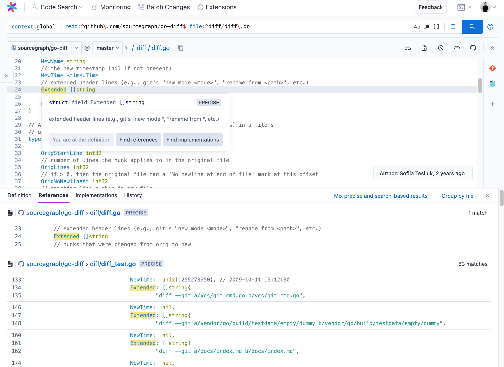

# Code intelligence

<!-- 
Advanced code navigation
 -->

Code Intelligence adds advanced code navigation to Sourcegraph, enabling
developers to explore code by

<ul class="lead">
<li>jumping to definitions</li>
<li>finding references</li>
<li>listing implementations</li>
<li>browsing symbols defined in current document or folder</li>
<li>navigate dependencies</li>
<li>documentation in hover tooltips</li>
</ul>

 

 

Multiple features are layered on top of each other allowing you to **go from
search-based code intelligence to automatically-updating, precise code
intelligence across multiple repositories and dependencies**:

- [Search-based code intelligence](explanations/search_based_code_intelligence.md) works out of the box with all of the most popular programming languages, powered by Sourcegraph's code search and [extensions](https://sourcegraph.com/extensions?query=category%3A%22Programming+languages%22)
- [Precise code intelligence](explanations/precise_code_intelligence.md) uses [LSIF indexes](https://lsif.dev/) to provide correct code intelligence features and accurate cross-repository navigation
- [Auto-indexing](explanations/auto_indexing.md) uses [Sourcegraph executors](../admin/executors.md) to automatically create LSIF indexes for the repositories in your Sourcegraph instance, giving you up-to-date cross-repository code intelligence without any manual indexing
- Auto-dependency indexing adds precise code intelligence  you to search the dependencies of your code and indexes them 

Once setup on Sourcegraph, code intelligence is available for use across popular development tools:

- On the Sourcegraph web UI
- On code files on your code host, via [integrations](../../../integration/index.md)
- On diffs in your code review tool, via integrations
- Via the [Sourcegraph API](https://docs.sourcegraph.com/api/graphql)

<!-- Code intelligence includes: -->

<!-- - [Search-based code intelligence](explanations/search_based_code_intelligence.md) -->
<!-- - [Precise code intelligence](explanations/precise_code_intelligence.md) -->
<!-- - [Auto-indexing](explanations/auto_indexing.md) -->
<!-- - Auto-dependency indexing -->

<!-- 
 -->
<!-- <a class="btn btn-primary" href="explanations/introduction_to_code_intelligence">★ Introduction to code intelligence</a> -->
<!-- <a class="btn" href="references/indexers">🗂 LSIF supported languages</a> -->
<!-- <a class="btn" href="apidocs">📚 API docs for your code</a> -->
<!-- 
 -->

## Code Intelligence for your code

Here's how you get the best possible code intelligence for your code in your
Sourcegraph instance:

1. [Search-based code intelligence](explanations/search_based_code_intelligence.md) with [Sourcegraph extensions](../../../extensions/index.md): works out of the box
1. Manual precise code intelligence: [create LSIF index and upload it](how-to/index_a_go_repository.md)
1. Manual precise code intelligence with automatic uploads: [add LSIF indexing and uploading to CI](how-to/adding_lsif_to_workflows.md)
1. Automatic precise intelligence: [Enable auto-indexing](how-to/enable_auto_indexing.md)
1. Automatic dependency indexing: package repos

<!-- 
 -->
<!--   <a href="../../integration/browser_extension" class="btn" alt="Install the browser extension"> -->
<!--    Install the browser extension -->
<!--      -->
<!--    Add code intelligence to your code host and/or code review tool by installing the Sourcegraph browser extension. -->
<!--   </a> -->

<!--   <a href="https://www.youtube.com/watch?v=kRFeSK5yCh8" class="btn" alt="Watch the code intelligence demo video"> -->
<!--    Demo video -->
<!--      -->
<!--    Watch the code intelligence demo video to see it in action on GitHub. -->
<!--   </a> -->

<!--   <a href="https://sourcegraph.com/github.com/dgrijalva/jwt-go/-/blob/token.go#L37:6$references" class="btn" alt="Try code intelligence on public code"> -->
<!--    Try on public code -->
<!--      -->
<!--    Interested in trying code intelligence out on public code? See this sample file on Sourcegraph Cloud. -->
<!--   </a> -->
<!-- 
 -->

## [Explanations](explanations/index.md)

- [Introduction to code intelligence](explanations/introduction_to_code_intelligence.md)
- [Precise code intelligence](explanations/precise_code_intelligence.md)
  - [Precise code intelligence uploads](explanations/uploads.md)
- [Search-based code intelligence](explanations/search_based_code_intelligence.md)
- [Code navigation features](explanations/features.md)
  - [Popover](explanations/features.md#popover)
  - [Go to definition](explanations/features.md#go-to-definition)
  - [Find references](explanations/features.md#find-references)
  - Experimental [Dependency navigation](explanations/features.md#dependency-navigation)
  - [Find implementations](explanations/features.md#find-implementations)
  - [Symbol search](explanations/features.md#symbol-search)
- [Writing an indexer](explanations/writing_an_indexer.md)
- Experimental [Auto-indexing](explanations/auto_indexing.md)
- Experimental [Auto-indexing inference](explanations/auto_indexing_inference.md)

## [How-tos](how-to/index.md)

- General
  - [Configure data retention policies](how-to/configure_data_retention.md)
- Language-specific guides
  - [Index a Go repository](how-to/index_a_go_repository.md)
  - [Index a TypeScript or JavaScript repository](how-to/index_a_typescript_and_javascript_repository.md)
  - [Index a C++ repository](how-to/index_a_cpp_repository.md)
  - [Index a Java, Scala & Kotlin repository](https://sourcegraph.github.io/lsif-java/docs/getting-started.html)
- Automate uploading LSIF data
  - [Add LSIF to many repositories](how-to/adding_lsif_to_many_repos.md)
  - [Adding LSIF to CI workflows](how-to/adding_lsif_to_workflows.md)
  - Experimental [Enable auto-indexing](how-to/enable_auto_indexing.md)
  - Experimental [Configure auto-indexing](how-to/configure_auto_indexing.md)

## [Tutorials](tutorials/index.md)

- [Manually index a popular Go repository](tutorials/indexing_go_repo.md)
- [Manually index a popular TypeScript repository](tutorials/indexing_ts_repo.md)

## [References](references/index.md)

- [Requirements](references/requirements.md)
- [Troubleshooting](references/troubleshooting.md)
- [FAQ](references/faq.md)
- [Sourcegraph recommended indexers](references/indexers.md)
- [Environment variables](references/envvars.md)
- Experimental [Auto-indexing configuration](references/auto_indexing_configuration.md)

